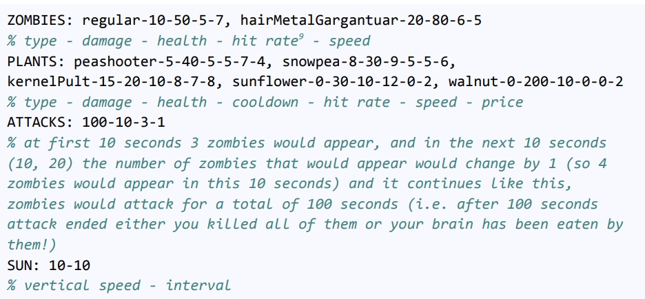

# Plants vs Zombies

This project is the fifth assignment for the Advanced Programming course at the University of Tehran. It is developed in C++ using the SFML library.

## Features

- **Language:** C++
- **Library:** SFML

## Requirements

- **C++ Compiler:** GCC.
- **SFML Library:** Ensure SFML is installed on your system. You can download it from [SFML's official website](https://www.sfml-dev.org/).

## Game Settings

To configure the game, refer to the `settings.txt` file in the `files` folder.

